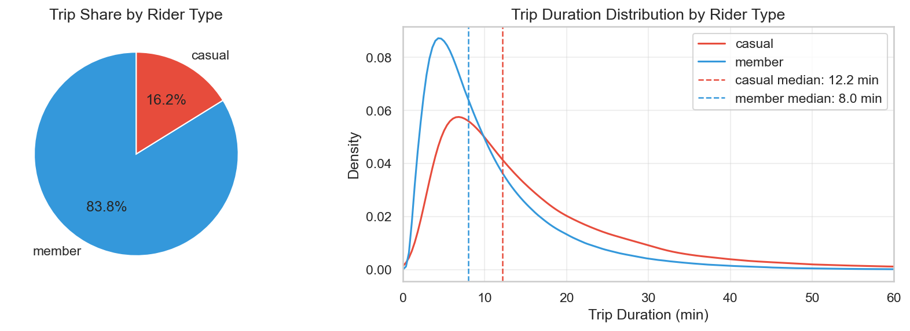
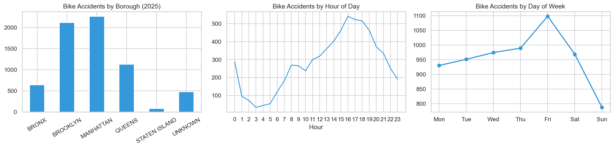
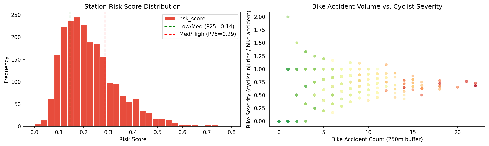
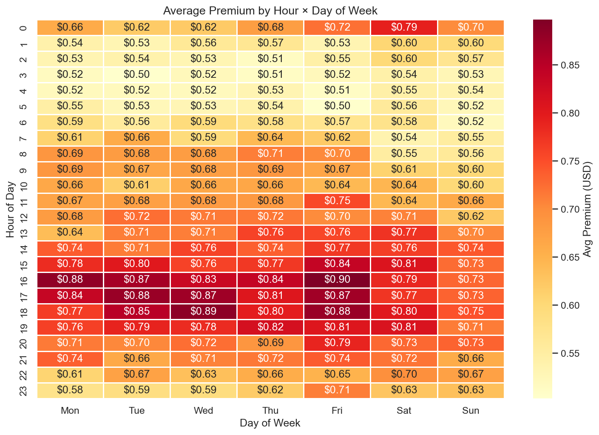

# CitiBike × AXA: Pay-per-Ride Micro-Insurance

CitiBike and AXA can partner to offer CitiBike customers a built-in accident coverage for bike rides. The premium for the coverage is priced dynamically based on an underlying risk model that is supported by historical trip and crash/collision data. 

## Data

Two public datasets drive the model: **CitiBike trip data** (~9.3M trips in 2025 — timestamps, station coordinates, rider type) and **NYPD Motor Vehicle Collisions** (~6,700 bicycle-involved crashes with geocoded locations, injury counts, and vehicle types). Details: [NB01 — CitiBike EDA](notebooks/01_eda_citibike.ipynb), [NB02 — NYPD EDA](notebooks/02_eda_nypd.ipynb).

## Risk Model

Every trip gets a risk score from three multiplicative factors, each derived from data:

```
trip_risk = rider_multiplier × temporal_multiplier × station_risk 
```

### Rider Multiplier

Casual riders take ~50% longer trips than members (median 12.2 min vs. 8.0 min median), meaning more time in traffic and higher exposure per trip. Moreover, the EDA supports the hypothesis that members use CitiBike mainly to commute to and from work and are therefore more familiar with riding bikes in NYC. In consequence, casual rider should be associated with higher risk.

The rider multiplier is each segment's median duration relative to the overall fleet median (8.6 min), yielding a **1.42× multiplier for casual riders** and **0.93× for members** — casual riders pay a proportionally higher premium.



→ [NB01 — Rider Segments](notebooks/01_eda_citibike.ipynb)

### Temporal Multiplier

Accident risk varies sharply by time. NYPD data shows a clear peak between 3–6 PM and elevated risk on weekdays vs. weekends. Manhattan and Brooklyn account for >60% of all bicycle crashes. The temporal multiplier adjusts each trip's risk by its hour and day-of-week, derived directly from the crash distribution below.



→ [NB02 — NYPD Patterns](notebooks/02_eda_nypd.ipynb)

### Station Risk

Each CitiBike station is scored using a two-stage composite that captures both **local accident exposure** and **destination exposure** — the risk profile of where trips from that station typically end.

**Stage 1 — Local Risk (NYPD crash data within 250m)**

A weighted sum of three cyclist-focused signals, all min-max normalised to [0, 1]:

- **0.4 × bike accident count** — collisions directly involving a bicycle near the station
- **0.4 × cyclist injuries** — sum of cyclists injured or killed (captures severity)
- **0.2 × total accident count** — general collision density as a context signal

The 40/40/20 weighting keeps the score cyclist-focused: a station near a busy road with many car crashes but few cycling incidents scores lower than one with frequent bike-on-bike incidents.

**Stage 2 — Destination Risk (mean end-station risk across outgoing trips)**

For each start station, the mean local risk score of all its trips' end stations is computed from the ~9.3M trip dataset. This captures a structural bias the local signal cannot: a calm residential station may see most of its trips end in Midtown Manhattan — one of the highest-risk zones in the network. Without a destination term, such a station would be systematically underpriced. Stations with no recorded outgoing trips fall back to their own local score.

**Blended Score**

```
risk_score = 0.70 × local_risk_score + 0.30 × destination_risk_score
```

The 70/30 weighting reflects that the local NYPD signal is the denser, more direct measure of departure-zone hazard, while destination exposure is a meaningful but noisier correction. Both component scores are retained as separate columns for interpretability. This produces a right-skewed distribution: most stations remain low-risk, and the minority in Manhattan and Brooklyn continue to drive the tail — but stations in low-incident areas that feed high-risk destinations are now correctly elevated.



→ [NB03 — Spatial Analysis](notebooks/03_spatial_analysis.ipynb) · [Interactive station risk map — open in browser](https://robhal-ds.github.io/citibike-case/outputs/figures/03_station_risk_map.html)

### Premium Calculation

The raw risk score is min-max normalized across all trips and mapped to a premium:

```
premium = $0.50 + normalized_risk × $1.50
```

- **$0.50 floor** — covers expected loss ($0.04/trip) + admin costs, even for lowest-risk rides
- **$2.00 ceiling** — highest-risk trips (Manhattan, Friday 4 PM, casual rider) carry a meaningful premium, still under half the casual ride price
- **$0.71 average** — validated against top-down actuarial estimates

The heatmap below shows how premiums vary across hour and day-of-week:



→ [NB04 — Risk Model & Premium Calculator](notebooks/04_risk_model.ipynb)


## Business Case

| Metric | Value |
|---|---|
| Expected loss per trip | ~$0.04 |
| Average premium (from risk model) | $0.71 |
| Gross Written Premium (NYC) | ~$875K / year |
| Loss ratio | ~5% |
| Combined ratio (loss + admin expenses) | ~38% |
| AXA net margin | ~42% |
| AXA net contribution (NYC) | ~$369K / year |

**Assumptions:**
- **NYC bike crashes (2025):** ~6,700 bicycle-involved collisions (NYPD data, NB02)
- **CitiBike trip share:** 10% of all NYC cycling trips → ~670 CitiBike-involved crashes/year
- **Claim rate:** 25% of CitiBike-involved crashes result in an insurance claim → ~168 claims/year
- **Avg payout per claim:** $2,000 fixed accident benefit (lump-sum cash payment, not cost reimbursement)
- **CitiBike revenue share:** 20% of GWP paid to CitiBike as distribution fee
- **Admin expenses:** $200K fixed/year (data scientist, infrastructure, compliance) + 10% of GWP variable
- **Casual opt-in rate:** 30% (tourists and infrequent riders value coverage)
- **Member opt-in rate:** 10% (frequent riders have lower perceived need)

**Top-down validation:** 6,700 NYC bike crashes × 10% CitiBike share → ~670 CitiBike-involved crashes → ~168 claims/year at 25% claim rate × $2,000 avg payout = ~$335K total losses across ~9.3M trips → **~$0.04 expected loss per trip**. The combined ratio of ~38% = 5% loss ratio + 33% admin expenses ($200K fixed + 10% variable). After paying claims, admin costs, and CitiBike's 20% revenue share, AXA retains ~42% of GWP (~$369K/year).

→ [NB04 — Business Case Section](notebooks/04_risk_model.ipynb)

## Model Limitations

The formula is a production-ready baseline, but five structural constraints bound its accuracy:

- **Partial departure scoring** — The premium is priced at the start station using both local crash data and the mean risk of that station's trip destinations. This corrects for systematic destination bias (e.g. residential stations feeding Midtown corridors) but does not capture route-level risk along the full trip path. *Fully overcome with route-level scoring once GPS trace data is available via a CitiBike app partnership.*

- **Station and time effects treated as independent** — The formula applies the same temporal multiplier to every station equally, so a busy-intersection station (risky only during rush-hour congestion) and a poorly-lit station (risky mainly at night) receive the same time-of-day scaling — only their base score differs. In reality each station's risk profile peaks at different times. *Overcome by training a model that estimates station × time jointly once real claims data is available.*

- **Duration as a crude exposure proxy** — The rider multiplier uses trip length as a stand-in for accident probability but ignores rider skill, e-bike vs. classic bike, and route familiarity. *Overcome by segmenting on bike type (electric vs. classic) and, if available, member/user data.*

- **No weather or seasonal adjustment** — The temporal multiplier reflects the average 2025 crash distribution by hour and day of week; rain, snow, and seasonal daylight changes all meaningfully alter crash rates. *Overcome by joining trips to an NYC weather API (precipitation flag, temperature) and adding a fourth weather multiplier.*

- **Adverse selection not priced in** — Higher-risk riders (tourists in dense corridors, afternoon casual rides) are more likely to opt in than the assumed 30% average, which could push the actual loss ratio above the modelled 16%. *Overcome by monitoring opt-in rates by station tier and time band during the first 3-month pilot and recalibrating assumptions before full rollout.*

## Next Steps & Further Considerations

### Path to ML
A supervised model is feasible via **spatio-temporal proxy labeling**. The idea: join the ~6,700 geocoded + timestamped NYPD crashes against ~9.3M geocoded + timestamped CitiBike trips. Trips that were active near a crash location (≤250m) within a time window (±30 min) are labeled `accident_proximal = 1`; everything else is `0`.

This label isn't "this rider had an accident" — it's "a real accident happened near where and when this rider was riding." That's noisy, but it's a legitimate exposure proxy. 

A model trained on this target (XGBoost, logistic regression) could capture patterns the formula cannot:
- **Interactions** — a specific station may be dangerous only during rush hour, not uniformly
- **Seasonality** — summer vs. winter crash patterns per station -> increase data to cover years before 2025.
- **Non-linear effects** — risk may not scale linearly with raw accident count
- **Temporal granularity** — date-level variation instead of year-aggregated multipliers

**Caveats for solving this problem using machine learning:**
- **Class imbalance** — <0.1% positive rate (6,700 in 9.3M) requires careful calibration, and the lift over the formula may be marginal
- **Ecological label** — "a crash happened nearby" ≠ "this rider crashed," so the signal-to-noise ratio is low
- **Validation gap** — without real claims, we can't measure whether the ML model actually prices risk better
- **Explainability** — a formula premium decomposes into 3 transparent factors; XGBoost requires SHAP for regulatory compliance (EU AI Act Art. 13)

The formula serves as a production-ready baseline. Once real claims data accumulates (6–12 months post-launch), train a supervised model on actual outcomes and validate whether it outperforms the formula on held-out claims. Every adjuster-corrected auto-assessment also becomes labelled training data for continuous improvement.

### Route-level risk
Current model scores departure stations. With GPS traces from the CitiBike app, score the actual route — a rider on aprotected bike lane has meaningfully different risk than one on busy streat with high taxi density.

### GenAI in Claims.
Four high-leverage applications for the claims lifecycle:

- **FNOL Chatbot** — LLM-guided claim intake in the CitiBike app. Pre-fills trip context (GPS, timestamp), captures injury details in <3 minutes vs. 30-minute call centre average.
- **Photo Damage Assessment** — Rider uploads damage photos, vision model estimates severity and repair cost. ~65% of low-severity claims (dooring, falls) become eligible for straight-through processing.
- **Document Intelligence** — LLM extracts structured fields from medical reports and repair invoices, replacing manual data entry (8–12 min → <5 sec per document).
- **GPS Fraud Detection** — Automatic plausibility check: compare reported accident location against actual trip GPS track. A free fraud signal unique to bike-share — traditional insurers don't have trip-level data.

All GenAI components are designed for augmentation with human-in-the-loop oversight, audit trails, and, when rolled out in EU, complient with EU AI Act.
